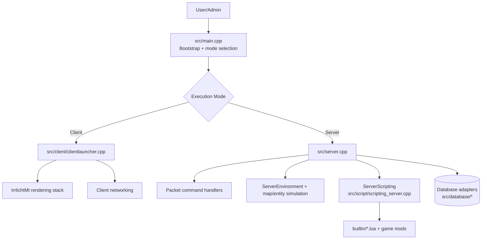
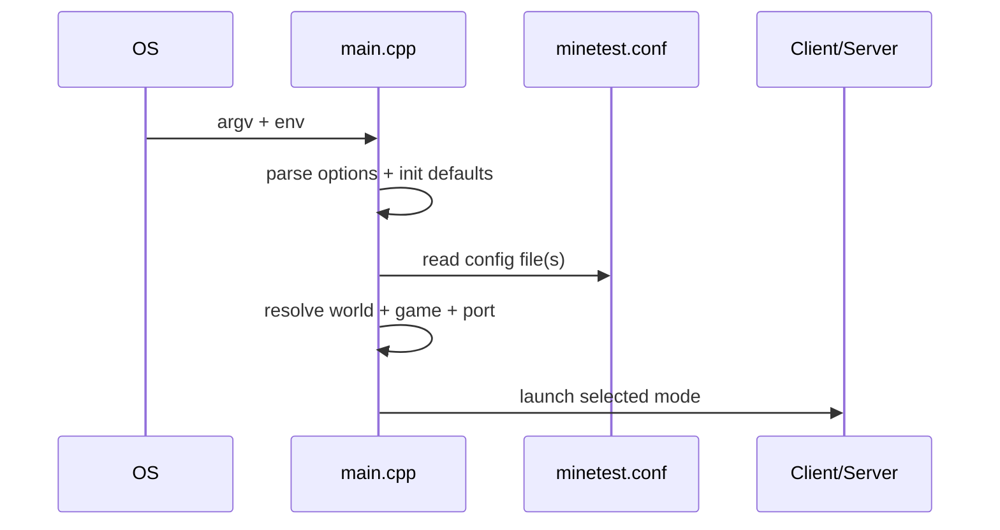
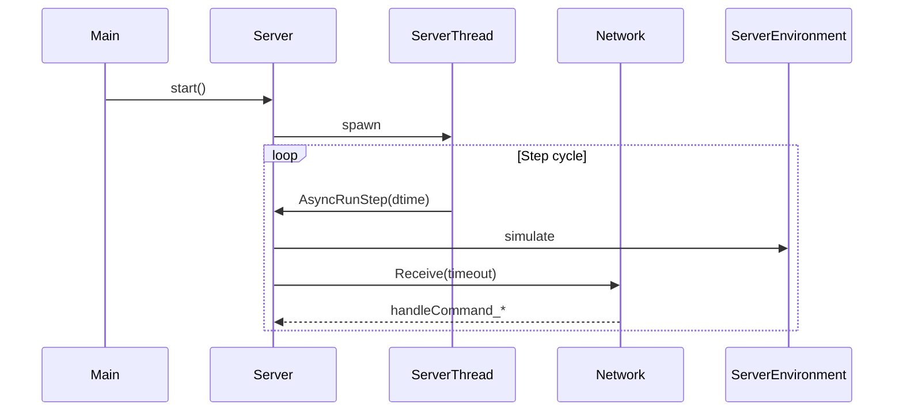
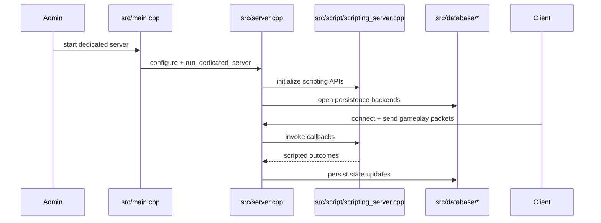

# Minetest Repository Architecture Onboarding (Senior Technical Architect)

> Scope: repository-level architecture and onboarding map for senior engineers.
> Validation basis: current branch content as of this review.

## 1. Overview

Minetest is an open-source voxel game engine focused on modding and game creation. It supports two core operational modes:

1. **Graphical client runtime** (singleplayer and multiplayer client).
2. **Dedicated server runtime** (headless authoritative simulation).

The business purpose is to provide a stable, scriptable platform where game behavior is largely defined in Lua while performance-sensitive systems remain in C++.

## 2. Technical Stack & Context

| Section | Content |
|---|---|
| Languages/Frameworks | C++17 engine via CMake, Lua/LuaJIT scripting, Android Gradle packaging, shell-based CI/build scripts. |
| Architecture Pattern | Layered engine architecture with client/server separation and a C++↔Lua scripting boundary. |
| Primary Entry Points | `src/main.cpp`, `src/client/clientlauncher.cpp`, `src/server.cpp`/`src/server.h`, `src/script/scripting_server.cpp`. |
| Key Directories | `src/`, `src/client/`, `src/script/`, `src/database/`, `builtin/`, `games/`, `mods/`, `doc/`, `.github/workflows/`. |

## 3. System Architecture

## 4. Core Components

### 4.1 Bootstrap and Mode Dispatch
- **Path:** `src/main.cpp`
- **Responsibility:** Process bootstrap, CLI/env parsing, logging setup, config loading, mode-specific dispatch to client or dedicated server.
- **Key Dependencies:** `Settings`, `porting`, `ClientLauncher`, `Server`, `httpfetch`, sockets.
- **Public/External Surface:** CLI options (`--run-unittests`, `--server`, `--world`, `--gameid`, migration flags, etc.).

### 4.2 Client Launcher
- **Path:** `src/client/clientlauncher.cpp`
- **Responsibility:** Rendering/input/audio/UI initialization and menu-to-game transition loop.
- **Key Dependencies:** GUI subsystems, rendering engine, networking exceptions, optional sound backend.
- **Operational Notes:** Handles menu/game lifecycle and reconnect/disconnect transitions.

### 4.3 Dedicated Server Runtime
- **Path:** `src/server.h`, `src/server.cpp`
- **Responsibility:** Authoritative multiplayer state, packet handling, server-step loop, and world updates.
- **Key Dependencies:** `network/*`, `serverenvironment`, map/mapgen modules, database adapters, chat interfaces.
- **Concurrency Model:** Main thread supervises; `ServerThread` executes `AsyncRunStep` and receive windows.

### 4.4 Lua Scripting Boundary
- **Path:** `src/script/scripting_server.cpp`
- **Responsibility:** Registers server Lua APIs (auth, craft, env, inventory, mapgen, particles, rollback, HTTP, storage, channels) and async scripting engine initializers.
- **Key Dependencies:** `lua_api/*`, `cpp_api/*`, `settings`, `Server`.
- **Security Behavior:** Reads `secure.enable_security`; warns when mod security is disabled.

### 4.5 Persistence Layer
- **Path:** `src/database/CMakeLists.txt`, `src/database/database*.{h,cpp}`
- **Responsibility:** Backend abstraction for map/player/auth/mod-storage persistence.
- **Backends Present:** SQLite, PostgreSQL, Redis, LevelDB, file-based, dummy.
- **Design Characteristic:** Compile-time inclusion plus runtime usage patterns from server configuration/migration paths.

## 5. External Integrations

- **Datastores:** SQLite3, PostgreSQL, Redis, LevelDB.
- **Media/Localization/Audio:** cURL, gettext, OpenAL, Vorbis.
- **Compression/Utility:** Zlib, Zstd, JSONCPP, GMP.
- **Rendering:** IrrlichtMt.
- **Container/Platform Integrations:** Docker (`Dockerfile`), Kubernetes example (`misc/kubernetes.yml`), Android pipeline (`android/`, workflow).

## 6. Key Business Logic

1. **World/game resolution pipeline** in `main.cpp` selects world path and subgame before runtime launch.
2. **Authoritative server stepping** in server thread maintains deterministic simulation ownership server-side.
3. **Lua-driven gameplay extensibility** allows game/mod behavior without recompiling core engine.
4. **Migration-capable storage architecture** supports backend transitions through dedicated runtime flags.

## 7. Execution / Data Flow

## 8. Architectural Patterns & Design Decisions

| Category | Observed |
|---|---|
| Structural Patterns | Layered architecture with client/server split and script bridge. |
| Behavioral Patterns | Command-handler style network processing (`handleCommand_*` family), threaded server loop. |
| Integration Patterns | Optional dependency toggles in CMake; multi-backend database adapter approach. |
| Data Patterns | Backend abstraction for storage implementations in `src/database/`. |
| Design Decisions | Balance between mod extensibility and native performance by combining Lua APIs with C++ core. |

**Pending Verification**
- Whether newer protocol/feature branches introduce materially different flow-control patterns not represented in the inspected files.

## 9. Coding Standards & Conventions

| Aspect | Evidence |
|---|---|
| Formatting | `.editorconfig` enforces LF and tab-based indentation (size 4) for C++/Lua/CMake/etc. |
| Static Analysis | `.clang-tidy` enables selected performance/modernize checks; `.luacheckrc` defines Lua global policy. |
| Organization | Domain directories (`network`, `mapgen`, `database`, `script`, `client`, `server`). |
| Error Handling | Mixed explicit status returns and exception handling in bootstrap/server thread boundaries. |
| Testing | Runtime hooks (`--run-unittests`, `--run-benchmarks`) and CI workflows executing test/build jobs. |

## 10. Security, Configuration & Environment

### Environment Variables (detected)

| Key | Purpose |
|---|---|
| `MT_LOGCOLOR`, `NO_COLOR`, `CLICOLOR`, `CLICOLOR_FORCE` | Logging color behavior controls. |
| `MINETEST_USER_PATH` | User data/config path override. |
| `MINETEST_SUBGAME_PATH`, `MINETEST_WORLD_PATH`, `MINETEST_MOD_PATH` | Content path overrides. |
| `LANGUAGE`, `LANG` | Locale selection behavior. |
| `HOME`, `XDG_CACHE_HOME`, `PATH` | Platform path/runtime behavior dependencies. |
| `MINETEST_POSTGRESQL_CONNECT_STRING` | CI/test database connection variable. |

### Configuration Files

| File | Purpose |
|---|---|
| `minetest.conf.example` | Runtime configuration baseline. |
| `CMakeLists.txt`, `src/CMakeLists.txt` | Build options and dependency toggles. |
| `Dockerfile` | Containerized server build/runtime. |
| `misc/kubernetes.yml` | Example K8s deployment/service. |
| `.github/workflows/*.yml` | CI/CD build/test automation. |

### Redaction Audit

- No hardcoded secrets were copied into this document.
- Any credentials visible in repository CI examples should be treated as non-production placeholders and not reused as-is.

## 11. Operational Context

| Section | Content |
|---|---|
| Build Process | Native CMake builds produce `minetest` and/or `minetestserver`; flags enable/disable optional features. |
| Deployment | Desktop binaries, Android build artifacts, Docker server image, optional Kubernetes deployment template. |
| Observability | Built-in logging controls and optional Prometheus support in server builds (feature-flagged). |

## 12. Technical Debt & Risks

| Category | Assessment |
|---|---|
| Identified Debt | `src/main.cpp` remains a high-responsibility bootstrap unit (CLI, config, mode dispatch, utility actions). |
| Architectural Risks | Wide optional-dependency matrix increases cross-platform drift risk. |
| Dependency Concerns | Complex native dependency chain can create version mismatch issues across package ecosystems. |

## 13. Suggested Improvements

1. Split bootstrap concerns in `main.cpp` into focused orchestrator units (CLI, config, mode strategy).
2. Add architecture decision records (ADRs) for scripting model, persistence strategy, and protocol evolution.
3. Generate and publish a feature matrix (build flags → runtime capabilities).
4. Add an operator security baseline document (network exposure, auth defaults, mod security).
5. Standardize observability guidance (log fields, Prometheus metric conventions).

---

## Discovery Notes (Phase 0)

- **Entry-point scan completed:** CMake signatures confirmed (`CMakeLists.txt`, `src/CMakeLists.txt`).
- **Repository boundaries reviewed:**
  - Business logic: `src/server*`, `src/client*`, `src/script*`, `src/network*`, `src/mapgen*`.
  - Infrastructure: `cmake/`, `.github/workflows/`, `Dockerfile`, `misc/kubernetes.yml`.
  - Boilerplate/vendor: `lib/`, static assets/translations.
- **Large repo handling:** bounded file listing and targeted file reads were used to avoid broad recursive scans.
